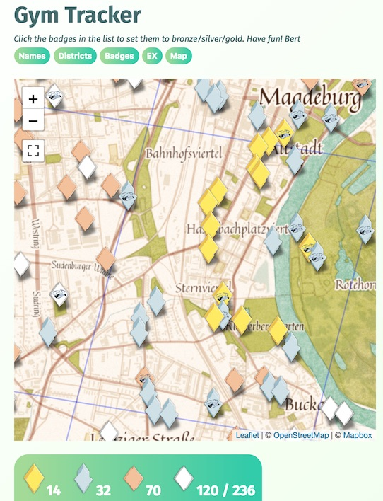

# Gym Badge Progress Tracker for Pokémon GO

This is the progress tracker I made for our local community in Magdeburg, Germany.
It shows which gyms are eligible for EX raids (according to OSM tags)
and lets individual trainers keep track of their golden/silver/bronze badges.

It uses a [static list of gyms](gymdata.js) so there is no TOS violation. 

## Try it

You can see the Magdeburg instance running at https://freudenbergs.de/bert/gymprogress/.
Click the badges to change level.
Badges are stored only in the browser's `localStorage`, not on the server.
Badges can be transfered/saved, you can use [mine](https://freudenbergs.de/bert/gymprogress/?2022002111210213220210201120221302001302201011112201021121101202201131331210132211111202100320211100201000201102101011100300020100233111000020001021222321131000210220110322111101223222211233010222001121330112101132001000010300201000101001) for testing.
You can also [clear](https://freudenbergs.de/bert/gymprogress/?0) them again.

## To adapt this to your city

Clone this repo, replace the [`gymdata.js`](gymdata.js) file, host it on some website, and share that URL in your community.

I used the method outlined by u/Tntnnbltn to generate the [list of gyms eligible for
EX raids](https://www.reddit.com/r/TheSilphRoad/comments/7ojuoi/how_to_determine_which_gyms_are_eligible_from_ex/).

You can use either my [English](gymtracker-en.html) or [German](gymtracker-de.html) html files, or add your own translation.

## Contributing

If you have any fixes or additions, or e.g. you translate the [`gymtracker.html`](gymtracker-en.html) file to another language,
[please send a pull request](https://github.com/bertfreudenberg/gymprogress/pulls).

## Thanks

I have learned a lot about Pokémon GO in the incredible [SilphRoad](https://www.reddit.com/r/TheSilphRoad) community.
Thank you, travelers!
